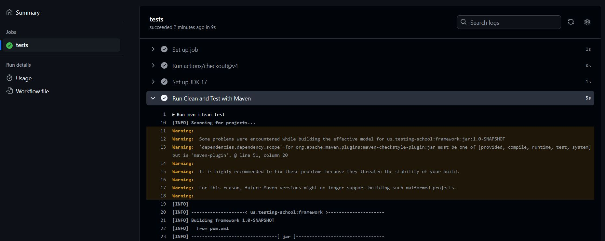

# API Automation Framework (Java+JUnit)

Java API automation framework that does its job in a simple but effective way. It is designed to work with HTTP APIs but can be adapted to work with other protocols.

Libraries used:

- REST Assured - HTTP client
- dotenv - Environment variables reader
- JUnit 5 - Assertions and test runner

This example uses the [Restful-booker](https://restful-booker.herokuapp.com/apidoc/index.html) API for demonstration purposes.

## Setup

Before you begin, make sure you have [Java](https://www.oracle.com/java/technologies/downloads/) and [Maven](https://maven.apache.org/) and installed on your machine.

### Preparing your Environment

Before starting with the setup, fork the repository and ensure you have a local copy of it following these steps, which will also guide you to set up your environment:

1. **Fork the Repository**: Begin by forking the repository to your GitHub account. This creates your own copy of the project where you can make your changes.

2. **Clone the Forked Repo**: Clone the forked repository to your local machine to start working on the changes.

    ```bash
    git clone https://github.com/YOUR_USERNAME/YOUR_FORKED_REPO.git
    ```

3. Navigate to the project directory on your terminal. This is where the `src` folder is located.

    ```bash
    cd api-automation-training\framework
    ```

4. Install the necessary dependencies by running the following command in the root folder:

    ```bash
    mvn install
    ```

### Setting up your local environment

The `.env` file is used to store environment variables that are important for running your tests. By default, this file is not tracked by Git to prevent sensitive data like usernames and passwords from being shared publicly.

- Start by copying the `example.env` file provided in the project directory:

    ```bash
    copy example.env .env
    ```

- Open the `.env` file in your preferred text editor and update the following properties with your local environment values:

    ```yaml
    BASEURL=api_base_url
    USER=username
    PASSWORD=password
    ```

  Make sure to replace `api_base_url`, `username`, and `password` with the actual values you wish to use for testing. The `BASEURL` should point to the base URL of the API you are testing. `USER` and `PASSWORD` are used for scenarios where authentication is required.

**Note:** it is crucial to **never** commit the values from the .env file or your personal environment variables to version control in a real project, as it can expose sensitive information.

### Maven Plugins

#### Checkstyle

You can use Checkstyle with the help Maven to validate your code and make sure you follow pre-defined guidelines set in [checkstyle.xml](checkstyle.xml) for imports, constructors, etc.

This project is configured to have some light and recommended checks. If you wish to expand the rules being enforced, [you can read available rules here](https://checkstyle.sourceforge.io/checks.html).
More documentation about it [can be found here](https://checkstyle.sourceforge.io/config.html).

```bash
mvn checkstyle:checkstyle
```

#### Prettier

Prettier is a plugin you can use with Maven to make sure all your code follow a set of defined format guidelines defined in [.prettierrc.yml](.prettierrc.yml).
More documentation on what to define about it [can be found here](https://prettier.io/docs/options)

- Check for issues:

```bash
mvn prettier:check
```

- Resolve issues:

```bash
mvn prettier:write
```

### Running the tests

```bash
# Runs all tests
mvn clean test

# Runs tests by tag
mvn clean test -Dgroups=Smoke
mvn clean test -Dgroups=Regression
```

## Getting started

The idea behind this framework is to encapsulate endpoints on Service Models, for maintainability and re-usability. You can think of Service Models as an analogy of Page Object Models for UI Automation.

## Service Models

In this framework, Service Models are used to encapsulate the API endpoints you are testing. This abstraction allows for better maintainability and re-usability of your test code. The concept here is somewhat similar to the Page Object Model used in UI Automation, where each service model represents a specific set of functionality provided by your API.

### Understanding `ServiceBase`

The `ServiceBase` class is the foundation of all Service Models. It provides common functionality needed for making API requests and processing responses. When you create a new Service Model, it should extend `ServiceBase` to inherit these capabilities. This approach ensures consistency and reduces boilerplate code in your service models.

Here's what `ServiceBase` offers:

- **API Client Management**: It initializes and holds an instance of the `ApiClient`, ensuring that all service models use the same API client setup.
- **Base URL Configuration**: It dynamically sets the base URL for API requests using the `BASEURL` from your `.env` file. This allows for flexibility across different environments (e.g., development, staging, production).
- **Authentication**: The `authenticate` method simplifies the process of authenticating with the API. Once called, it stores the authentication token in the request headers, so subsequent API calls are authenticated. Note that as explained below in the [Authentication](#authentication) section, this is specific to this API, and must be adapted to your use case.
- **HTTP Methods**: `ServiceBase` provides methods for common HTTP requests (GET, POST, PUT, PATCH, DELETE, HEAD, OPTIONS). These methods handle the request execution and timing, then format the response into a standardized `Response` object, making it easier to work with.

### Extending `ServiceBase`

When you create a Service Model, you extend `ServiceBase` and define methods specific to the service you're testing. For example, a `BookingService` might have methods like `getBooking` or `createBooking`. Each method uses the HTTP methods provided by `ServiceBase` to interact with the API.

Here's a simple example of a service model:

```java
public class BookingService extends ServiceBase {
    public BookingService() {
        super("/booking");
    }

    public ResponseContainer<BookingResponse> addBooking(BookingModel model, Map<String, String> headers) {
        return this.post(this.url, model, headers, BookingResponse.class);
    }

    public ResponseContainer<BookingModel> getBooking(Long bookingId, Map<String, String> headers) {
        return this.getOne(this.url + "/" + bookingId, headers, BookingModel.class);
    }

}
```

By extending ServiceBase, BookingService gains all the functionalities of making HTTP requests, handling authentication, and standardizing responses, allowing you to focus on the logic specific to the Booking service.

### Other Models

In addition to **Service Models**, you should declare **Request** and **Response** models as needed. For example, here is the BookingModel that will be used to deserialize the response from the endpoint above.

```java
public class BookingModel {
    
    private Integer id;
    private String firstname;
    private String lastname;
    private Integer totalprice;
    private Boolean depositpaid;
    private BookingDates bookingdates;
    private String additionalneeds;

    public BookingModel() {
    }

// Getter and setter methods    
}
```

## Tests

Next, you can create a simple test like this.

```java
@Test
public void testGetBooking() {
    service.authenticate();
    ResponseContainer<BookingModel> response = service.getBooking(1l, null);

    Assertions.assertEquals(200, response.getStatus());
    Assertions.assertNotNull(response.getData());
}
```

Note the BookingModel on the generic getBooking function. With that in place, you can easily assert against the response body properties.

```java
@Test
public void createBookingSuccessful() {
    BookingModel model = new BookingModel();

    model.setFirstname("Jim");
    model.setLastname("Brown");
    model.setDepositpaid(true);
    model.setTotalprice(111);
    model.setAdditionalneeds("Breakfast");
    BookingModel.BookingDates bookingDates = new BookingModel.BookingDates();
    bookingDates.setCheckin("2018-01-01");
    bookingDates.setCheckout("2019-01-01");
    model.setBookingdates(bookingDates);

    service.authenticate();
    ResponseContainer<BookingResponse> response = service.addBooking(model, null);
    
    BookingModel responseModel = response.getData().getBooking();
    
    Assertions.assertEquals(200, response.getStatus());
    Assertions.assertNotNull(response.getData().getBookingid());
    Assertions.assertEquals(model.getFirstname(), responseModel.getFirstname());
    Assertions.assertEquals(model.getLastname(), responseModel.getLastname());
    Assertions.assertEquals(model.getDepositpaid(), responseModel.getDepositpaid());
    Assertions.assertEquals(model.getTotalprice(), responseModel.getTotalprice());
    Assertions.assertEquals(model.getAdditionalneeds(), responseModel.getAdditionalneeds());
    Assertions.assertEquals(model.getBookingdates().getCheckin(), responseModel.getBookingdates().getCheckin());
    Assertions.assertEquals(model.getBookingdates().getCheckout(), responseModel.getBookingdates().getCheckout());
}
```

In the example above, I am using a call to the addBooking endpoint to create the booking needed for the getBooking test, and then using the newly created booking to assert against it.

## Performance

Request duration is measured and saved to the responseTime property of the response object. Therefore, you can add assertions to check the response time of each request.

```java
@Test
public void getBookingSuccessfulLessThan1000ms() {
    service.authenticate();
    ResponseContainer<BookingModel> response = service.getBooking(1000l, null);

    Assertions.assertEquals(200, response.getStatus());
    Assertions.assertTrue(response.getResponseTime() < 1000);
}
```

This makes adding simple but powerful performance checks to your API automation suite very easy.

## Authentication

The authentication process depends on the method required by the API, but in most cases, it involves sending tokens in the request headers.

In this repository, the API uses an `/auth` endpoint to obtain a token, which is then sent in the request headers as a cookie. To streamline this process, I’ve added an `authenticate()` method in the `ServiceBase` class, making it easy to authenticate with the API.

Additionally, the token is cached so that subsequent calls to `authenticate()` from any service do not result in unnecessary requests to the server.

Here’s the implementation of the `authenticate()` method:

```java
public final void authenticate() {
    String username = EnvironmentUtils.getInstance().get("USER");
    String password = EnvironmentUtils.getInstance().get("PASSWORD");

    if (StringUtils.isEmpty(username) || StringUtils.isEmpty(password)) {
    throw new RuntimeException(ErrorMessages.MISSING_USERNAME_PASSWORD);
    }

    String token = SessionManager.getCachedToken(username, password);
    if (!StringUtils.isEmpty(token)) {
    saveCookieInHeaders(token);
    return;
    }

    CredentialModel credentialRequest = new CredentialModel(username, password);

    ResponseContainer<SessionResponse> loginResponse = this.post(baseUrl() + "/auth", credentialRequest, null, SessionResponse.class);

    token = loginResponse.getData().getToken();

    SessionManager.storeToken(username, password, token);
    saveCookieInHeaders(token);
}
```

Then you can use it on the services that require authentication, like in the before hook below.

```java
@BeforeEach
public void setup() {
    service.authenticate();
}
```

## CI / CD

This repository utilizes GitHub Actions for continuous integration and delivery (CI/CD). Our pipeline is configured to run all tests on each Pull Request or Merge to the main branch.

Check the [Actions](https://github.com/damianpereira86/api-framework-ts-mocha/actions) tab to see passed and failed pipelines.



Ensure that you configure any necessary environment variables and secrets. These can be managed in the repository’s **Settings** under **Secrets and variables**.

1. Repository Variables: Go to Settings > Secrets and variables > Actions > Variables. (e.g., BASEURL)
2. Repository Secrets: Go to Settings > Secrets and variables > Actions > Secrets.(e.g., USER and PASSWORD)

You can customize the CI/CD pipeline to suit your project's needs. For example, you can adjust which branches trigger the pipeline, add steps for deployment, or configure notifications.

To get started with GitHub Actions in your project, check out the `.github/workflows` directory in this repository. Here, you'll find the workflow files that define our CI/CD processes. You can modify these files to change the pipeline or add new workflows.

For more detailed examples and advanced features, refer to the [GitHub Actions Documentation](https://docs.github.com/en/actions).

But each of them depends on the project needs, the tools of choice, etc. Hence, I’ll be adding examples of possible extensions that could be useful for some of you, while leaving this repo as light and straight forward as possible.

## Next steps

Now it’s time to use it. Go ahead and explore the test examples in this repo and adapt it to your use case. I’m sure there are much better ways to tackle some of the features of this framework, and I will be more than happy to hear them and include them in the repo. Or better, you can include them yourself!

## Contact/Support

If you have any questions, encounter any issues, or simply want to provide feedback regarding this project, I'm here to help and listen!

Here are a few ways you can reach out for support or assistance:

- **Submit an Issue**: If you find any bugs or issues, feel free to open an issue on the [GitHub issues page](https://github.com/damianpereira86/api-framework-ts-mocha/issues). Please provide as much detail as possible to help me understand and address the problem quickly. <font color="red">CAMBIAR A LA PAGINA DE GIULI O QUITAR</font>

- **Discussions**: For questions, suggestions, or general discussions about the project, please use the [Discussions](https://github.com/damianpereira86/api-framework-ts-mocha/discussions) section of the GitHub repository. This is a great place to connect with other users and contributors, share ideas, and get advice. <font color="red">IGUAL ACA</font>

- **Email**: If you prefer direct communication, you can email me at [giulianabentancor@gmail.com](mailto:giulianabentancor@gmail.com). I'll try to respond as promptly as possible.

## Contribution Guidelines

I welcome contributions from everyone and value your input and ideas. Here's how you can contribute:

1. **Fork the Repository**: Begin by forking the repository to your GitHub account. This creates your own copy of the project where you can make your changes.

2. **Clone the Forked Repo**: Clone the forked repository to your local machine to start working on the changes.

    ```bash
    git clone https://github.com/YOUR_USERNAME/YOUR_FORKED_REPO.git
    ```

3. **Create a New Branch**: Create a new branch on your local repository for each set of changes you want to make. This keeps your modifications organized and separate from the main project.

    ```bash
    git checkout -b your-new-branch-name
    ```

4. **Make Your Changes**: Implement your changes, fix a bug, add a new feature, or update documentation as needed in your new branch.

5. **Commit Your Changes**: Commit your changes with a clear and descriptive commit message. This message should explain what you've done and why.

    ```bash
    git commit -m "Add a concise but descriptive commit message"
    ```

6. **Push Changes to Your Fork**: Push your changes to your fork on GitHub.

    ```bash
    git push origin your-new-branch-name
    ```

7. **Submit a Pull Request**: Go to your fork on GitHub and click the 'New pull request' button. Select the original repository as the base and your branch as the compare. Fill in the pull request with a title and description that explains your changes.

8. **Wait for Review**: Wait for the review of your changes. Be ready to make additional changes based on the feedback.

9. **Merge**: Once your changes have been approved, they will be merged into the main project.

Please ensure that your code adheres to the project's standards and has passed all tests.

I look forward to your contributions. Thank you!

## License

This project is licensed under the MIT License - see the [LICENSE](LICENSE.txt) file for details.